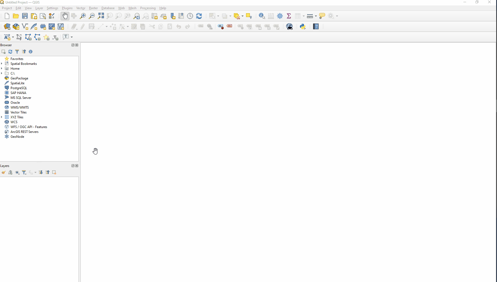
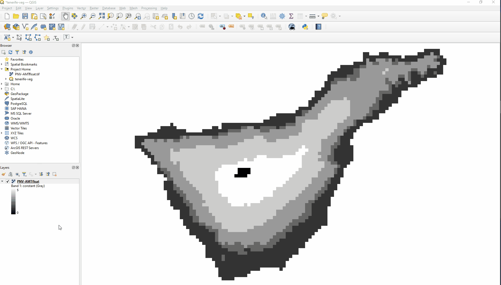
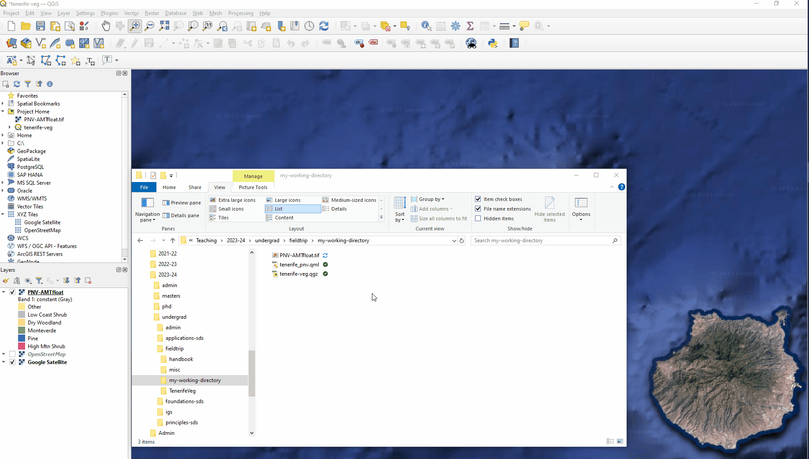

# Potential Natural & Actual Current Vegetation of Tenerife
_Practical, 24 January 2025 with [james.millington@kcl.ac.uk](mailto:james.millington@kcl.ac.uk)_

## 0. Introduction

While in Tenerife we visited multiple locations to see how vegetation varied across the island, considering the physical and human drivers of what influences both the potential natural vegetation (PNV) but also the actual current vegetation (ACV) on the island. In this practical we will use Google Earth Engine (GEE) and QGIS to create an initial simple map of PNV and ACV. As well as showing you how to use these tools to produce a professional map based on secondary data and your observations in the field, the practical will also help you to think about how to improve the simple map for your report (should you chose the Vegetation Coursework 2 Question – see the fieldtrip handbook).

By the end of this practical you should have:

1. Produced a simple PNV map of Tenerife using GEE
2. Imported the simple PNV map into QGIS
3. Created a shapefile to overlay the location of ACV
4. Created a QGIS 'Layout' from the combination of 1, 2 and 3 to produce a professional map (of the sort that might be included in your report)

These objectives are laid out in the next four sections of this document, along with accompanying videos (see KEATS). You should aim to finish sections 1-4 by the end of the timetabled practical, to produce a map that looks something like Figure 1 (which is a rough map and I would expect better in your report, should you choose the Vegetation Question for Coursework 2).


*Figure 1. A rough map produced by the end of section 4*

You should then pursue improvements in the map (improving the digitization and layout and possibly using section 5) in any remaining time during the practical or afterwards while working on your report.

## 1. Creating a simple PNV map with GEE

You should already have a Google Earth Engine account (whether from the session in his module with Emma Tebbs last term, or from the Research Skills module). If you did not do that see the instructions provided on KEATS. NB: it can take several days for your account to be activated so if you do not already have an account you may need to work with a friend for the GEE parts of this practical. This practical builds on some of the things you did with Emma Tebbs previously, so you may want to review the instructions for that practical quickly before starting here. For example, see the section _What is Google Earth Engine (GEE)?_ to remind yourself of the GEE basics.

  - Task 1.1 **Open Google Earth Engine** by visiting [https://code.earthengine.google.com/](https://code.earthengine.google.com/) and logging in with your account. **Create a new script** by clicking the red *NEW* button, selecting *File*, provide a sensible filename, and then click OK.  

  - Task 1.2 **Copy and paste** the following code into the GEE Code Editor (you can quickly use the copy button in the top-right of the code block below) and **click ‘Run’ in GEE** to run the script.

```javascript
//Centre the map on the coordinates of Tenerife, with a zoom of 10
var lon = -16.6192096994827;
var lat = 28.24084164623232;
var zoom = 10;
Map.setCenter(lon, lat, zoom)

//Get administrative area polygon for Tenerife and display
//Date described here: https://developers.google.com/earth-engine/datasets/catalog/USDOS_LSIB_2017
var dataset = ee.FeatureCollection('USDOS/LSIB/2017');              //create a dataset from the cloud data
var tenerifeBBox = ee.Geometry.Rectangle([-17, 27.9, -16, 28.6]);   //define a bounding box around Tenerife
var filtered = dataset.filterBounds(tenerifeBBox);                  //from the dataset select only data within the bounding box
var poly = filtered.geometry().coordinates().get(8);                //select only Tenerife's polygon (it's the 8th in the dataset)
var tenerife = ee.Geometry.Polygon(poly);                           //create a polygon GEE recognises from the Tenerife polygon
Map.addLayer(tenerife, {color: 'green',}, 'Tenerife')               //add the GEE polygon to the map
```
After running the code, GEE should look like Figure 2.


*Figure 2. GEE view after task 1.2*

See if you can understand what the code here does. Loading a polygon of the boundary of Tenerife will be useful below to work only with data for Tenerife. Much of the data supplied in the [Earth Engine Data Catalog](https://developers.google.com/earth-engine/datasets) is global in extent, and it's much quicker to clip the data just to work with the smaller region we want.

For example, the next block of code reads the [WorldClim](https://developers.google.com/earth-engine/datasets/catalog/WORLDCLIM_V1_BIO#description) data set and immediately <a href="https://gisgeography.com/clip-tool-gis/" target="_blank">'clips'</a> it to the extent of Tenerife.

  - Task 1.3 **Copy and paste** the following code into the GEE Code Editor (below the last block of code) and **click ‘Run’ in GEE** to run the script.


```javascript
// Get and Clip the WorldClim V1 Bioclim dataset using the Tenerife boundary
// See https://developers.google.com/earth-engine/datasets/catalog/WORLDCLIM_V1_BIO#bands
var worldClim = ee.Image("WORLDCLIM/V1/BIO").clip(tenerife);

//Get the Annual Mean Temperature band
var annMeanTemp = worldClim.select('bio01').multiply(0.1);

// Define visualization parameters
var tempVisParam = {
  bands: ["bio01"],
  min: 0,
  max: 25,
  palette: ['#fef0d9','#b30000']
};

// Add the layer to the map
Map.addLayer(annMeanTemp, tempVisParam, 'Ann. Mean Temp.');
```
**Save your script** by clicking the Save button at the top of the script pane. (Save your work regularly, even if not instructed to do so!)

After clipping the _WorldClim_ data to the extent of Tenerife, this code selects the _bio01_ band which contains the annual mean temperature variable (see the [WorldClim Earth Engine Data Catalog webpage](https://developers.google.com/earth-engine/datasets/catalog/WORLDCLIM_V1_BIO#bands) for more details) and puts this in a new layer called `annMeanTemp`. Then the code sets some visualisation parameters ('make the layer red where 0 is light red and 25 is dark red') and the last line of code adds the layer to the map with the visualisation.

Once the code has been run, GEE should look like Figure 3. Remember that you can modify the visibility of layers that we are adding to the map, as shown in the animation.  


*Figure 3. GEE view after task 1.3 with animation showing layer control*

As you will remember from the field, we know that temperature changes with elevation (decreasing with the [adiabatic lapse rate](https://en.wikipedia.org/wiki/Lapse_rate)). We also know that vegetation in different ecosystems can survive in different conditions, including temperature ranges. For example, [Chapter 6](https://link.springer.com/chapter/10.1007/978-3-319-77255-4_6) of _Vegetation of the Canary Islands_ by del Arco & Rodriguez Delgado (2018) [listed in the Key Readings for this project in the Fieldtrip Handbook] suggests annual mean temperature limits for the five main ecosystems we discussed in the field. These are summarised in Table 1 here.

*Table 1. Annual mean temperature (&deg;C) limits for Canary Island Ecosystems.* After del Arco & Rodriguez Delgado (2018)

| ID | Ecosystem | Min. | Max. | Map Colour |
| -- | --------- | --- | --- | ---- |
| 1 | Low Coast Shrub | 19 | ? | Purple |
| 2 | Thermo. Woodland | 15 | 19 | Orange |
| 3 | Monteverde | 13 | 18 | Green |
| 4 | Canary Pine | 11 | 15 | Blue |
| 5 | High Mtn. Shrub | 6 | 11 | Pink |

We can use these to make a simple Potential Natural Vegetation map using the _WorldClim_ annual mean temperature - we will classify pixels into one of the five ecosystems depending on their value. The following block of code does this in GEE:

```javascript
//create a simple PNV model using temperature
var pnvAMT = ee.Image(1)
          .where(annMeanTemp.gt(19), 1)
          .where(annMeanTemp.gt(15).and(annMeanTemp.lte(19)), 2)
          .where(annMeanTemp.gt(13).and(annMeanTemp.lte(18)), 3)
          .where(annMeanTemp.gt(11).and(annMeanTemp.lte(15)), 4)
          .where(annMeanTemp.gt(6).and(annMeanTemp.lte(11)), 5)
          .where(annMeanTemp.lte(6), 0);
```

**Save your script** by clicking the Save button at the top of the script pane.

See if you can understand how this code is working. `where()` is a GEE function that [performs conditional replacement of values](https://developers.google.com/earth-engine/apidocs/ee-image-where). The first 'argument' in the `where()` call indicates where pixels are that should change (the condition), and the second argument indicates what value they should be given (the replacement). So, for example, `where(annMeanTemp.gt(19), 1)` means _'where you find pixels in the `annMeanTemp` layer with a value greater than 19, replace with a value of 1'_.

That works for _Low Coast Shrub_ which has only a minimum value, but what about where we have both a minimum and maximum? For that we need to use the logical `and` statement to create a condition that is both greater than (`gt`) one value *and* less than (`lt`) another value. So, `annMeanTemp.gt(6).and(annMeanTemp.lte(11))` is the condition for _High Mtn. Shrub_, and pixels meeting these conditions will be given a value of 5.

Check you can see how multiple `where()` functions are linked together (using `.`) to cover all the ecosystems in Table 1. But notice also on the last line we have a `where()` statement that is not shown in the Table. This is needed for any pixels that are not covered by all the other conditions in the code - specifically, pixels that have an annual mean temperature less than 6&deg;C (we'll assume these are bare ground... think about where they might occur on Tenerife).

All these `where()` functions are linked together and the output is saved into a new layer named `pnvAMT` (for potential natural vegetation using annual mean temp.).  

So that's our model. Now we need a few more lines of code to visualise our new layer and to add it to the map:

```javascript
//we need a couple of lines so that the model is applied only to Tenerife and not the whole world!
var mask = ee.Image.constant(1).clip(tenerife).mask()
var pnvAMT = pnvAMT.updateMask(mask);

// Define visualization parameters
var pnvColours = ['#ffff99','#beaed4','#fdc086','#7fc97f','#386cb0','#f0027f']
var pnvVisParam = {bands: ['constant'], min: 0, max:5, palette: pnvColours};

// Add the layer to the map
Map.addLayer(pnvAMT, pnvVisParam, 'PNV (AMT)')
```

  - Task 1.4 **Copy and paste** the last two blocks of code (the simple PNV model and the visualisation code) into the GEE Code Editor (at the bottom of all the other code) and **click ‘Run’ in GEE** to run the script.


*Figure 4. GEE view after Task 1.4*

There it is! Our simple PNV model. Adding a legend for this map requires a lot of code (shown in the appendix below if you want to try adding it). The colours used in the map are shown in Table 1, with yellow used to indicate bare ground.

**Save your script** by clicking the Save button at the top of the script pane.

Using the colours in the Table think about what this simple PNV model shows. Does it match your expectation? For example:
- is the Low Coast Shrubland where we would expect it?
- what about the Monteverde and Pine?
- is the yellow bare ground in the right place?

You might vary the transparency of the layer with satellite imagery beneath to help you with this assessment. Hopefully, you'll agree that some ecosystems are mapped quite well with this simple model, but others not so well. Why might that be? What does this simple model not consider?

You can come back to improve the model later in section 5 (by adding additional variables), but before that we will see how we can export this simple PNV map from GEE and then work with it in QGIS to produce a more professional map to include in reports (also adding info about actual current vegetation).

To export from GEE, we run some code in the code editor as before but then we need to go to the *Tasks* tab to run a task. This task exports the data to your Google Drive from where you download the data locally to use in QGIS.

 - Task 1.5 **Copy and paste** the next block of code into the GEE Code Editor (at the bottom of all the other code) and **click ‘Run’ in GEE** to run the script.


```javascript
// Export the PNV map https://developers.google.com/earth-engine/guides/exporting_images

//set the projection of the output map
var projection = worldClim.select('bio01').projection().getInfo();

//set the NoData (non-land) pixels to -99
var pnvAMTMasked = pnvAMT.unmask(-99)

//export the image as a raster
//we specify float values so that NoData pixels are recognised properly (see link below)
Export.image.toDrive({
  image: pnvAMT.toFloat(),  //.toFloat from https://gis.stackexchange.com/q/423712
  description: 'PNV-AMTfloat',
  crs: projection.crs,
  crsTransform: projection.transform,
  region: tenerife
});

//go to Task tab to save to Drive then download from there
```

You'll note that after running the script with this latest block of code, no new data was added to the map. Rather, this code has created a Task that we now need to run to export the data to Google Drive to download, as shown in the animated Figure 5.


*Figure 5. Animation running a GEE task to export and download data*

  - Task 1.6 **Run the task** _PNV-AMTfloat_ task in the Task tab, then **download exported data to your local computer** from Google Drive. Use the animation in Figure 5 as a guide, to do the following:
    1. Click 'Run' in the Tasks tab
    2. In the run dialogue window that appears, check the default values match those in Figure 5 (most important being that the file format is *GEO_TIFF*), then click 'Run'
    3. In the Tasks tab, click the down arrow on the running task to see details (it will take up to a minute for the task to complete)
    4. When the task is complete, a button to 'Open in Drive' will appear - click this button
    5. Switch to the new browser tab that opens (this should be your Google Drive), find the _PNV-AMTfloat.tif_ file, right-click on the file, then left-click 'Download'

You should now find the file _PNV-AMTfloat.tif_ in your Downloads folder.

**Save your script** by clicking the Save button at the top of the script pane.

## 2. Import PNV map to QGIS and visualise

GEE is excellent for processing large amounts of pre-existing (usually raster) data. However, it is not so good at presenting spatial data and does not provide much functionality for creating new vector data. For those things, Geographic Informations Systems - like QGIS - are much more useful. We'll switch now to use QGIS to add additional information and present the simple PNV map created above (later you can improve the PNV map if you want).

You will find [the QGIS documentation](https://docs.qgis.org/3.28/en/docs/index.html) useful to review, including a handy guide to the [graphical interface](https://docs.qgis.org/3.28/en/docs/user_manual/introduction/qgis_gui.html) and details on [how to work with raster data](https://docs.qgis.org/3.28/en/docs/user_manual/working_with_raster/index.html).

A video demonstrating the tasks taken in this section is available on KEATS (and via [this link](https://media.kcl.ac.uk/media/TenerifeVeg-Prac23-34-Section2.mp4/1_jdq37yyo) - King's login required). Hopefully the instructions below will be clear, but the video may help where you are uncertain.

While much of our work in GEE is in the cloud, we will be using QGIS on a local computer. To stay organised we should create a 'working directory' in which to save the data we'll be working with in QGIS for this project.

  - Task 2.1 **Create a new folder on your computer** (in a sensible location and with a sensible name) to save your QGIS data for this project. This folder will be referred to as the _working directory_.   

  - Task 2.2 **Open QGIS**. On King's computers that is most easily done by hitting the 'Windows key', then typing _QGIS_, then clicking the relevant icon (here, we assumes you are using version QGIS 3.28, as currently installed on King's computers)

  - Task 2.3 **Create a new project in QGIS** When opening QGIS you may be offered the option of creating a new project from a blank template - clicking this option is fine as long as the new project has projection _EPSG: 4326 (WGS84)_. Alternatively, click Project -> New.

You can read about working with project files in [the QGIS documentation](https://docs.qgis.org/3.28/en/docs/user_manual/introduction/project_files.html).

The next three tasks are shown by the animation in Figure 6.


*Figure 6. Opening raster data in a new QGIS project*

  - Task 2.4 **Save your new project** in your working directory. Click Project -> Save As then navigate to your working directory and give your project a sensble name, then click Save. You should see a Project Home folder is now visible in the QGIS Browser pane.  

  - Task 2.5 **Move the simple PNV GeoTiff file we exported from GEE (named _PNV-AMTfloat.tif_) to the working directory** using the Windows File Explorer (or Mac Finder). This file is likely still in you Downloads folder.

  - Task 2.6 **Add the simple PNV map as a Layer in QGIS** by clicking Layer -> Add Layer -> Add Raster Layer then selecting _PNV-AMTfloat.tif_. A greyscale version of your simple PNV map should appear in the main data window.

Great! We've imported the raster data. It's important you now **save your project** (as a `.qgz` file) so that you can return to your work in future and continue where you left off, with all the data imported and visualised as you want.

  - Task 2.7 **Save your project** by clicking Project -> Save

When the raster is initially imported, it comes with no visualisation metadata and QGIS just uses a linear greyscale to visualise the PNV categories. We can do better than this.

We want a unique colour for each vegetation type and a legend which communicates their correspondence. Doing this in QGIS this is called [band rendering](https://docs.qgis.org/3.28/en/docs/user_manual/working_with_raster/raster_properties.html#band-rendering) and can be done manually yourself or by using a [Style file](https://docs.qgis.org/3.28/en/docs/user_manual/introduction/general_tools.html?highlight=style%20file#save-and-share-layer-properties) that someone else has made. We will take the latter approach here, loading a Style file James made for the main ecosystem types we visited in Tenerife (and that are present in our simple PNV map).  

  - Task 2.8 **Download _tenerife_pnv.qml_ from KEATS and move it to your working directory**

The animation in Figure 7 shows the tasks we take to load the style file we just downloaded.   


*Figure 7. Loading a style file for a layer in QGIS*

  - Task 2.9 **Load the style for the PNV raster layer**. Do this by:
    - right-click the _PNV-AMTfloat_ layer
    - click Properties (bottom of menu)
    - click Symbology (tab on left)
    - click Style (bottom of dialogue box)
    - click Load Style
    - select _tenerife_pnv.qml_
    - click Open
    - click OK

This looks much better. Note that the legend for the colours we have used are now showing in the layers panel (if not, click the drop-down arrow for the _PNV-AMTfloat_ layer).

Finally, before we move on to digitzation, let's see how we can enable some background contextual layers. These include Open Street Map and Google Satellite imagery to support visualisation and digitization of land uses and current vegetation. The tasks to do this are shown by the animation in Figure 8.


*Figure 8. Adding XYZ tiles as layers in QGIS*

  - Task 2.10 **Add Open Street Map layer** by right-clicking on OpenStreetMap in the XYZ Tiles folder in the QGIS browser, then click Add Layer to Project. In the Layers pane, drag-and-drop the newly added OpenStreetMap layer to the bottom, so that the PNV map is visible on top

This Open Street Map layer is available in QGIS by default. Other context layers are possible, but we need to add connections to them first [as described in this guide](https://opensourceoptions.com/how-to-add-google-satellite-imagery-and-google-maps-to-qgis/). For example, to add a Google Satellite Imagery layer, we need to add a connection to the following URL: `https://www.google.cn/maps/vt?lyrs=s@189&gl=cn&x={x}&y={y}&z={z}`

  - Task 2.11 **Create an XYZ Connection to Google Satellite imagery** as follows:
    - right-click _XYZ Tiles_ in the QGIS browser
    - select New Connection
    - type 'Google Satellite' in Name
    - copy the URL above and paste into the URL box
    - click OK

Then add the Google Satellite layer to the project as you did in Task 2.10 for OpenStreetMap. Drag-and-drop layers to change the order in which they are shown on the map (e.g. put Google Satellite at the bottom).

**Save your project!**

## 3. Create shapefile and digitize in QGIS

A video demonstrating the tasks taken in this section is available on KEATS (and via [this link](https://media.kcl.ac.uk/media/TenerifeVeg-Prac23-24-Section3/1_531y4k2m) - King's login required). Hopefully the instructions below will be clear, but the video may help where you are uncertain.

To map current vegetation and land use we can manually delineate areas by digitizing [polygon features](https://pro.arcgis.com/en/pro-app/latest/help/data/geodatabases/overview/feature-class-basics.htm). First we need to [create a new shapefile layer](https://docs.qgis.org/3.28/en/docs/user_manual/managing_data_source/create_layers.html#creating-a-new-shapefile-layer) to contain the polgyons and their attribute data (i.e. the land use or vegetation types that correspond to each polygon). The tasks to do this are shown by the animation in Figure 9.


*Figure 9. Creating a new shapefile in QGIS*

  - Task 3.1 **Create a new shapefile** as follows:
    - right-click *Project Home* in the Browser pane then select *New* then *Shapefile*
    - change the File Name from *new_layer.shp* to something more intuitive (e.g. *tenerife-land-use.shp*) - DO NOT delete the entire path, just edit the *new_layer* bit
    - select *Polygon* as Geometry Type
    - add a *New Field* (using Name: Land Use) then click *Add to Fields List* then click OK

This should have created four new files in your working directory, with names as your provided above (e.g. *tenerife-land-use*) and suffixes .shp, .shx, .dbf and .qix. Despite creating four files on disk, this actually counts as only one shapefile! We don't need to worry about the multiple files on disk as long as we work with the shapefile from within QGIS.

If the new shapefile has not been added to your list of layers (i.e. is not visible in the bottom left pane), add it to the project by going to the *Project Home* folder in the Browser pane, right-click then **Add Layer to Project**.  

Now that we have created the new shapefile we can start adding information to it - specifically, by [digitizing (drawing) polygons and adding accompanying attribute data](https://docs.qgis.org/3.28/en/docs/user_manual/working_with_vector/editing_geometry_attributes.html#sec-edit-existing-layer). The tasks to digitize polygons are illustrated by the animation in Figure 10.


*Figure 10. Digitizing polygons in QGIS*

To facilitate the digitization of polygons, it is useful to [enable snapping](https://docs.qgis.org/3.28/en/docs/user_manual/working_with_vector/editing_geometry_attributes.html#snapping-and-digitizing-options).

  - Task 3.2 **Enable snapping** by
    - first, enable Snapping Toolbar (right-click on an empty area of a toolbar, then check snapping toolbar)
    - move the new toolbar if desired by drag-and-drop
    - click the magnet icon to enable snapping

Now we can start to draw our polygons. By default, all layers in QGIS are read-only. To edit the shapefile we made above we need to _Toggle Editing_, before then adding polygon features.

  - Task 3.3 **Digitize polygon features** by
    - right-click the shapefile layer to add polygons to (in this case *tenerife-land-use*) then click Toggle Editing (new icons will become available on the toolbar)
    - click the green icon for creating a *New Polygon Feature*
    - start drawing polygons (see below)
    - save your edits (new polygons) by clicking the *Save Layer Edits* button on the toolbar
    - remember to *Toggle Editing* off once you are finishing digitizing (either click the button on the toolbar next to *Save Layer Edits* or right-click the layer to toggle off via the layer context menu)

The process of actually drawing the polygons and adding attribute data is narrated in [the video for this section](https://media.kcl.ac.uk/media/TenerifeVeg-Prac23-24-Section3/1_531y4k2m) - you might find it useful to watch that in addition to following the instructions below.

To draw polygons:
- left-click to create vertices
- right-click to complete the polygon
- ensure polygons adjoin by creating shared vertices when the red 'snapping' icon appears
- if you need to move the map ('pan') while digitizing, hold the spacebar on the keyboard and move your mouse.

Once a polygon is completed, add attribute data:
- leave id box empty (polygon IDs will be autogenerated)
- type the name of the land use or vegetation class you have just created (e.g. Agriculture) in the Land Use field
- click OK

Once polygons have been digitized we can set their symbology so that we can see the different vegetation or land use types we have just created. This is [shown in the video from 13:21](https://media.kcl.ac.uk/media/TenerifeVeg-Prac23-24-Section3/1_531y4k2m?st=802).

  - Task 3.4 **Set polygon symbology** by:
    - right-click *tenerife-land-use* in the layer window to open the context menu
    - click Properties
    - select the Symbology tab
    - change symbology from Single Symbol to Categorized
    - set Value using the down arrow then select the Land Use field
    - click Classify near the bottom of the window
    - double-click class colours to change the colours of individual Land Use classes as desired
    - click OK

You may also want to remove the 'all other values' class (select then click red minus button), but note the challenge this presents when later adding new polygon classes (as shown in [the video from 16:57](https://media.kcl.ac.uk/media/TenerifeVeg-Prac23-24-Section3/1_531y4k2m?st=1017))

Note that the new colours and class names should now appear in the Layer legend (click the drop-down arrow next to the *tenerife-land-use* layer name if they are not initially visible).

**Save your project!** (Project menu -> Save)

To add more polygons repeat the tasks as above. Re-using the same land use class names for new polygons will ensure consistent symbology and legend.

I suggest you could digitize at a scale of around 1:100,000 (or 1:50,000 max). This doesn't need to be a super-fine-scale map but you need to be more careful than I am in the videos above (which I made quickly just to demonstrate the technical method). The raster data are at 1 km resolution (each pixel is 1 km per side) which is approximately the Minimum Mapping Unit (MMU) that your digitization should use. [The MMU is](https://www.esri.com/about/newsroom/insider/a-question-of-scale-resolution-and-mmu/):
> the specific size of the smallest feature that is being reliably mapped in your map.

Thus, you should not create any polygons smaller than 1 sq km and ideally most will be much larger. For consistency, the edges of polygons could follow the boundaries of pixels. You might also learn how to clip the extent of polygons to the coastline of Tenerife using another shapefile.

You could experiment with changing the transparency of the raster layer so that you can view it along with the satellite imagery when digitizing (right-click the raster layer, click Properties, select the Transparency layer on the left, use the slider to change the transparency of the raster layer).

## 4. Create a QGIS Layout for a professional map

In QGIS we can use [the Layouts feature](https://docs.qgis.org/3.28/en/docs/user_manual/print_composer/index.html) to create professional-looking maps to print or save them as an image (or PDF) to include in your reports and presentations. We'll look at how to do that now before potentially going back to GEE to see how we could improve our simple PNV map (in section 5).

The [QGIS documentation on Layouts](https://docs.qgis.org/3.28/en/docs/user_manual/print_composer/index.html) will be useful and a video demonstrating the tasks taken in this section is available on KEATS (and via [this link](https://media.kcl.ac.uk/media/TenerifeVeg-Prac23-24-Section4/1_5ibhol3b) - King's login required). Hopefully the instructions below will be clear, but the video may help where you are uncertain.

  - Task 4.1 **Create a new Layout** by
    - go to Project menu
    - click New Print Layout
    - enter a sensible Name
    - click OK

This should create a new drawing canvas in a new window. As shown in [the video on KEATS](https://media.kcl.ac.uk/media/TenerifeVeg-Prac23-24-Section4/1_5ibhol3b) we can add various elements to the canvas, including [the map](https://docs.qgis.org/3.28/en/docs/user_manual/print_composer/composer_items/composer_map.html#)  itself, [a legend](https://docs.qgis.org/3.28/en/docs/user_manual/print_composer/composer_items/composer_legend.html) for the map, a [scale bar](https://docs.qgis.org/3.28/en/docs/user_manual/print_composer/composer_items/composer_scale_bar.html), a [north arrow](https://docs.qgis.org/3.28/en/docs/user_manual/print_composer/composer_items/composer_image.html#the-north-arrow-item), and [text](https://docs.qgis.org/3.28/en/docs/user_manual/print_composer/composer_items/composer_label.html) and [shapes](https://docs.qgis.org/3.28/en/docs/user_manual/print_composer/composer_items/composer_shapes.html) (e.g. for title and data source). You will need to experiment with these tools and think for yourself about how you want to layout your map. Instructions from some items are suggested below.

  - Task 4.2 **Add a map to the layout** by
    - click the *Add Map* button from the vertical toolbar on the left of the screen
    - click-and-drag on the canvas to draw the map in the location and size/shape you want


  - Task 4.3 **Add a grid and frame**
    - ensure the map is selected and go to the *Item Properties* tab in the lower-right pane
    - scroll down to grid, click drop-down arrow, then green plus button, then select the grid in the list and click Modify Grid
    - set the interval for the spacing of the grid lines (by default this is in the units of the map projection, which for EPSG 4326 is decimal degrees)
    - change the colour of the lines if desired (select from *line style*)
    - add coordinates by checking the box for Draw Coordinates (change orientation of coordinates if desired)
    - add a frame from the choices if desired  


  - Task 4.4 **Add a scale bar and north arrow**
    - click the *Add Scale Bar* button from the vertical toolbar on the left of the screen
    - click-and-drag on the canvas to draw the scale bar in the location and size/shape you want
    - set units and symbology as desired in the *Item Properties* tab
    - add a background if needed
    - repeat for north arrow (select which version you like from the arrows)


  - Task 4.5 **Add a legend**
    - click the *Add Legend* button from the vertical toolbar on the left of the screen
    - click-and-drag on the canvas to draw the legend in the location and size/shape you want
    - uncheck auto-update to enable manual editing
    - select unnecessary layers (e.g. Google Satellite) and click red minus sign to remove from the legend
    - hide layer names by right-click the layer name and click Hidden
    - add a Legend Title
    - add a frame around the legend

Remember to **save your layout**. The layout is not saved by default when you save the Project. Saving the layout means that when you come back to your project you can continue editing. You can save multiple layouts if you want to create different maps (e.g. of different locations, different combinations of data layers, etc.)

These are just some of the things you can do. You could also try other things like adding an inset map. Aside the ['official' QGIS tutorial](https://docs.qgis.org/3.28/en/docs/training_manual/map_composer/map_composer.html) there are lots of other resources online, including [text tutorials](https://www.qgistutorials.com/en/docs/3/making_a_map.html) and [videos](https://youtu.be/LFJGLaH4Tvg?si=8dlRpvyPFV0XsY5z).  

Finally, we need to export our map to an image file so that we can insert it into a report or presentation. This is shown in [the video from 18:03](https://media.kcl.ac.uk/media/TenerifeVeg-Prac23-24-Section4/1_5ibhol3b?st=1083).

  Task 4.6 **Export your map layout as image**
  - click the Export as Image button on the toolbar
  - select your desired location to save the new image (by default this should be your working directory)
  - provide a sensible file name
  - click Save
  - pick your export options (the defaults are usually fine, 300dpi is a good resolution)

This process got you started on understanding how to use QGIS to create professional-looking maps. It is up to you to further develop your skills in this area (and remember, even if you don't use these skills for your Fieldtrip coursework, you can still use them for other work and projects!).  

## 5. Improving the PNV and ACV maps

Now that we have seen the full process of developing a potential natural vegetation (PNV) map in Google Earth Engine (GEE), importing that to QGIS and adding spatial information about current vegetation and land use, and finally creating a professional map in QGIS, we can return to GEE to think about how to improve the initial simple PNV map we made.

### 5.1 Precipitation
Temperature is an important determinant of vegetation in a region, but as we discussed in the field, so is precipitation (ultimately these combine together to influence evapotranspiration). Here, we will try to improve our simple PNV map by including precipitation in the model.

The [WorldClim dataset](https://developers.google.com/earth-engine/datasets/catalog/WORLDCLIM_V1_BIO#bands) contains several precipitation variables. We could try using the annual precipitation data (band *bio12*) - let's visualise that on the map to check it matches our understanding of the spatial distribution of precipitation over the island.

  - Task 5.1 **Copy and paste** the next block of code into the GEE Code Editor (at the bottom of all the other code) and **click ‘Run’ in GEE** to run the script.

```javascript
// Select the band for annual precipitation (bio12)
var annPptn = worldClim.select('bio12');

// Define visualization parameters for the annual precipitation layer
var apptnVisParam = {bands: ["bio12"],  min: 50,  max: 1200, palette: ['#f1eef6','#045a8d']};

// Add the annual precipitation layer to the map
Map.addLayer(annPptn, apptnVisParam, 'Ann. Precip.');
```
I'd argue that this dataset does not capture the influence of tradewinds and topography well. We know these result in wetter conditions on the north side of the island, and particularly in the north east. But the map we have just visualised doesn't really show this.

[A better precipitation map](https://docs.google.com/presentation/d/1dKnV-5zDE-7cOsYW1ve8olGE7MxAYzKetwJTrWafnAo/edit#slide=id.g29ec4ce47d8_0_1213) that accounts for topographic exposure is provided by Mark Mulligan's [WaterWorld model](https://doi.org/10.2166/nh.2012.217). James has uploaded this as a GEE asset which you should be able to access and visualise using the next code block.

  - Task 5.2 **Copy and paste** the next block of code into the GEE Code Editor (at the bottom of all the other code) and **click ‘Run’ in GEE** to run the script.

```javascript
// Get Mark Mulligan's topography-corrected rainfall map
// See https://docs.google.com/presentation/d/1dKnV-5zDE-7cOsYW1ve8olGE7MxAYzKetwJTrWafnAo/edit#slide=id.g29ec4ce47d8_0_1213
var wcAP = ee.Image('projects/ee-jamesmillington/assets/SumPrec_Tenerife_WaterWorld');

Map.addLayer(wcAP, {min: 50,  max: 1200, palette: ['#f1eef6','#045a8d']},  'Topo. Cor. Ann. Precip.');
```

Hopefully you agree this is a better representation of what we know about the spatial distribution of Tenerife rainfall. We can now combine this precipitation layer into our PNV model by building on the previous conditional statements, as shown in the next code block.  

  - Task 5.3 **Copy and paste** the next block of code into the GEE Code Editor (at the bottom of all the other code) and **click ‘Run’ in GEE** to run the script.

```javascript
//combine AMT and wcAP to improve the model
var pnvAMTwcAP = ee.Image(1).clip(tenerife)
          .where(annMeanTemp.gt(19).and(annMeanTemp.lte(35)), 1)
          .where(annMeanTemp.gt(18).and(annMeanTemp.lte(19)), 2)
          .where(annMeanTemp.gt(15).and(annMeanTemp.lte(18)).and(wcAP.lte(500)), 2)
          .where(annMeanTemp.gt(15).and(annMeanTemp.lte(18)).and(wcAP.gt(500)), 3)
          .where(annMeanTemp.gt(13).and(annMeanTemp.lte(15)).and(wcAP.gt(500)), 3)
          .where(annMeanTemp.gt(13).and(annMeanTemp.lte(15)).and(wcAP.lte(500)), 4)
          .where(annMeanTemp.gt(11).and(annMeanTemp.lte(13)), 4)
          .where(annMeanTemp.gt(6).and(annMeanTemp.lte(11)), 5)
          .where(annMeanTemp.gt(35).or(annMeanTemp.lte(6)), 0);

Map.addLayer(pnvAMTwcAP, pnvVisParam, 'PNV (AMT & wcAP)');
```

**Save your script** by clicking the Save button at the top of the script pane.

See if you can understand how this last code block has incorporated the precipitation data. Think about the following questions:
- Which ecosystem types is precipitation modelled as affecting and why?
- Where did the value of 500 come from and is this appropriate?
- Do you think the new PNV map is a better representation given the literature on Tenerife vegetation?

If you think you will address the Vegetation question for Coursework 2, you could think further about other drivers of PNV you might add and explore data available on the [Earth Engine Data Catalogue](https://developers.google.com/earth-engine/datasets).

### 5.2 Fire
While in Tenerife we also saw the influence of fire on current vegetation. Maybe this could also be included in a map of current vegetation. Rather than trying to digitise this ourselves, we could use data from remote sensing in GEE.

The MODIS satellites collect data at a 1 km resolution that is used partly to create daily maps of fire globally - [these data are available in GEE](https://developers.google.com/earth-engine/datasets/catalog/MODIS_061_MOD14A1). The next code block creates and visualizes a map that shows the extent of the 2023 fire as observed by the MODIS terra satellite.

  - Task 5.4 **Copy and paste** the next block of code into the GEE Code Editor (at the bottom of all the other code) and **click ‘Run’ in GEE** to run the script.

```javascript
//get MODIS terra Daily Fire https://developers.google.com/earth-engine/datasets/catalog/MODIS_061_MOD14A1
//for filtered time period and location
var fireTerra = ee.ImageCollection("MODIS/061/MOD14A1")
  .filter(ee.Filter.date('2023-07-15', '2023-11-11'))
  .filterBounds(ee.Geometry.Point([lon,lat]));

//could add code here to also load and use MODIS Aqua data https://developers.google.com/earth-engine/datasets/catalog/MODIS_061_MYD14A1#description

// select FireMask band only (values 7-9 indicate fire as detailed in the Bands info)
var fireMaskTerra = fireTerra.select('FireMask')

//get the maximum value for each day
fireMaskTerra = fireMaskTerra.max().clip(tenerife)

//create binary map of only nominal confidence or higher
var fire = ee.Image(0).clip(tenerife)
  .where(fireMaskTerra.gt(7),1);

Map.addLayer(fire, {min: 0, max: 1}, 'Fire');
```

You might think about how you could add a conditional statement to the PNV model code (previous code block) to integrate fire into the map as an additional PNV class (you might then also want to update the raster visualisation parameters).

# 6. Summary
The activities above have given you the tools to create an annotated map of the potential and current distribution of vegetation (and land use) that you could include in a report that answers the Vegetation question for Coursework 2 (see the fieldtrip handbook). While creating the map you should think further about how our understanding of the physical drivers of vegetation distribution (from the literature) could be incorporated. You should also think about what you saw while in Tenerife and combine those observations with visible satellite imagery to produce the map. If you are digitizing you should take more care than in the demonstration videos and animations, but work at a resolution similar to that of the raster data (with a minimum mappable unit of 1 sq km).

## Key Readings
- del Arco Aguilar, M. J., González-González, R., Garzón-Machado, V., & Pizarro-Hernández, B. (2010). Actual and potential natural vegetation on the Canary Islands and its conservation status. *Biodiversity and Conservation*, 19, 3089-3140.
- del Arco Aguilar, M. J. and Rodriguez Delgado, O. (2018) *Vegetation of the Canary Islands.* Springer. https://doi.org/10.1007/978-3-319-77255-4

## Appendix
*Code for a PNV legend in GEE*

Copy and paste this code at the bottom of your script to include a legend for PNV on the GEE map.

```javascript
//Create a legend in GEE to understand PNV map colours
//Code modified from: https://developers.google.com/earth-engine/datasets/catalog/projects_sat-io_open-datasets_us-drought-monitor

// Define a dictionary which will be used to make legend and visualize image on map
var dict = {
  names: [
    "Other", //0
    "Low Coast Shrub", //1
    "Dry Woodland", //2
    "Monteverde", //3
    "Pine", //4
    "High Mtn Shrub", //5
  ],
  colors: pnvColours,
};

// Create a panel to hold the legend widget
var legend = ui.Panel({style: {position: "bottom-left",padding: "8px 15px",}});

// Function to generate the legend
function addCategoricalLegend(panel, dict, title) {
  // Create and add the legend title.
  var legendTitle = ui.Label({
    value: title,
    style: {
      fontWeight: "bold",
      fontSize: "18px",
      margin: "0 0 4px 0",
      padding: "0",
    },
  });
  panel.add(legendTitle);

  var loading = ui.Label("Loading legend...", { margin: "2px 0 4px 0" });
  panel.add(loading);

  // Creates and styles 1 row of the legend.
  var makeRow = function (color, name) {
    // Create the label that is actually the colored box.
    var colorBox = ui.Label({
      style: {
        backgroundColor: color,
        // Use padding to give the box height and width.
        padding: "8px",
        margin: "0 0 4px 0",
      },
    });

    // Create the label filled with the description text.
    var description = ui.Label({
      value: name,
      style: { margin: "0 0 4px 6px" },
    });

    return ui.Panel({
      widgets: [colorBox, description],
      layout: ui.Panel.Layout.Flow("horizontal"),
    });
  };

  // Get the list of palette colors and class names from the image.
  var palette = dict["colors"];
  var names = dict["names"];
  loading.style().set("shown", false);

  for (var i = 0; i < names.length; i++) {
    panel.add(makeRow(palette[i], names[i]));
  }

  Map.add(panel);
}

// Add the legend to the map
addCategoricalLegend(legend, dict, "PNV");
```
